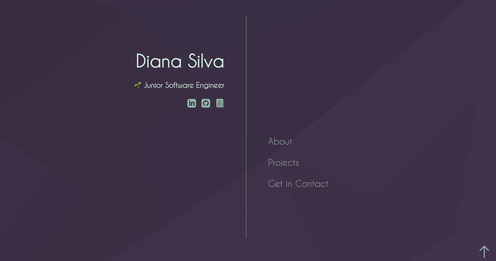

# My Portfolio

## Description
This is my **portfolio website** built to showcase my journey and skills as a beginner full-stack developer. The site features a clean, modern design with a focus on simplicity, accessibility, and user experience. It highlights my development work, background, and contact information.

---

## Snapshot

---

## Features

- **Home Page**: A welcoming landing page that introduces who I am, my role as a beginner Software Engineer, and links to my LinkedIn, GitHub, and downloadable resume.
- **About Me**: A section that provides insight into my background, including how I transitioned into tech and my passion for development.
- **Projects**: A dedicated area where I showcase my projects with brief descriptions and details about the tech stacks used.
- **Get in Contact**: A contact section that makes it easy for visitors to connect with me via email or social media for job opportunities, collaborations, or networking.
- **Subtle Animations**: Animations are incorporated to enhance the overall user experience, ensuring smooth transitions throughout the site.
- **PHP Form Handling**: A contact form that uses PHP to handle form submissions, sending messages to my email.

---

## Technologies Used

- **HTML**: For structuring the content and layout of the portfolio.
- **CSS**: For styling the website, including responsive design and animations.
- **JavaScript**: For implementing interactive features and functionality.
- **PHP**: For handling form submissions and sending messages to my email through the contact form.
- **Flexbox**: For creating a responsive, clean layout across different screen sizes.
- **Figma**: Used for designing the layout and visual elements before implementation.

---

## How It Works

1. **Home Page**: 
   - The landing page introduces who I am and provides easy navigation to other sections of the site, including links to my LinkedIn, GitHub, and resume.
   
2. **About Me**: 
   - This section shares my story of how I transitioned into tech, my learning journey, and the tools and resources I’ve used to develop my skills.

3. **Projects**: 
   - Here, visitors can explore a list of my projects, complete with brief descriptions and the technologies used in each project.

4. **Get in Contact**: 
   - Visitors can easily reach out to me via email or social media for job opportunities or collaborations. The contact form uses PHP to handle submissions and send messages directly to my email.

---

## Future Improvements

- **Project Filters**: 
  - Add the ability to filter projects by technology or category (e.g., "Front-End", "Back-End", "Full-Stack").
  
- **Interactive Resume**: 
  - Enhance the resume section with an interactive, downloadable version that allows users to view specific details based on categories like education, experience, and skills.

- **Improved Animations**: 
  - Add more dynamic animations and transitions to improve the user experience and make the site more engaging.
