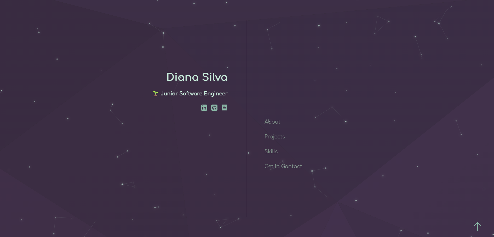

# My Portfolio

## Description
This is my **portfolio website** built to showcase my journey and skills as a junior software engineer specializing in cloud development. The site features a clean, modern design with a focus on simplicity, accessibility, and user experience. It highlights my serverless applications, AWS expertise, and development projects.

---

## Snapshot

---

## Features

- **Home Page**: A welcoming landing page that introduces who I am, my role as a Junior Software Engineer, and links to my LinkedIn, GitHub, and downloadable resume.
- **About Me**: A section that provides insight into my background, including how I transitioned into tech and my passion for development.
- **Projects**: A dedicated area where I showcase my projects with brief descriptions and details about the tech stacks used.
- **Skills & Technologies**: An organized section displaying my technical skills grouped by category (Frontend, Backend, Databases, Cloud Services, Tools & Design) with comprehensive AWS services including Lambda, API Gateway, DynamoDB, RDS, S3, CloudWatch, Secrets Manager, VPC, SNS, and EventBridge.
- **Get in Contact**: A contact section that makes it easy for visitors to connect with me via email or social media for job opportunities, collaborations, or networking.
- **Subtle Animations**: Animations are incorporated to enhance the overall user experience, ensuring smooth transitions throughout the site.

---

## Technologies Used

- **HTML**: For structuring the content and layout of the portfolio.
- **CSS**: For styling the website, including responsive design and animations.
- **JavaScript**: For implementing interactive features and functionality.
- **Flexbox**: For creating a responsive, clean layout across different screen sizes.
- **Figma**: Used for designing the layout and visual elements before implementation.

---

## How It Works

1. **Home Page**: 
   - The landing page introduces who I am and provides easy navigation to other sections of the site, including links to my LinkedIn, GitHub, and resume.
   
2. **About Me**: 
   - This section shares my story of how I transitioned into tech, my learning journey, and the tools and resources I’ve used to develop my skills.

3. **Projects**: 
   - Here, visitors can explore a list of my projects, complete with brief descriptions and the technologies used in each project.

4. **Skills & Technologies**: 
   - A comprehensive section organized into logical groups showcasing my technical expertise from frontend development to advanced AWS cloud services, featuring official AWS Architecture Service Icons and professional technology logos.

5. **Get in Contact**: 
   - Visitors can easily reach out to me via email or social media for job opportunities or collaborations.

